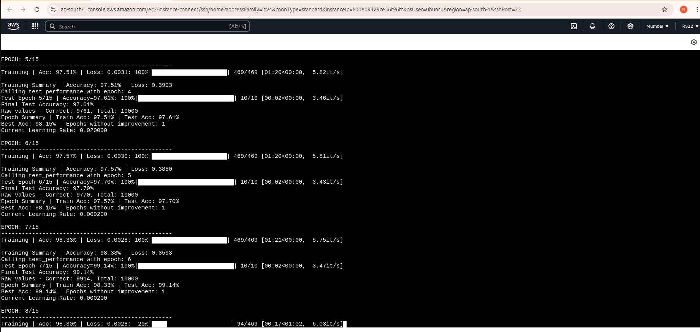

# MNIST Classification Model Evolution

This project demonstrates the evolution of a CNN model for MNIST classification, optimized for high accuracy (>99.4%) while maintaining a parameter count below 8000.


### **Model V1 (Base Model)**
**Target:**
- Simple CNN with standard convolutions
- Basic MaxPooling layers
- No batch normalization regularization and dropout
- No expectation on accuracy
- Augmentation is a constant across all 3 models as it helps in generalization and benefits of the same observed in Assignment6

**Results:**
- **Parameters:** 6536
- **Best Accuracy:** 95.68%

**Model Summary:**
```Python
==========================================================================================
Layer (type:depth-idx)                   Output Shape              Param #
==========================================================================================
├─Sequential: 1-1                        [-1, 16, 28, 28]          --
|    └─Conv2d: 2-1                       [-1, 8, 28, 28]           72
|    └─Conv2d: 2-2                       [-1, 10, 28, 28]          720
|    └─Conv2d: 2-3                       [-1, 16, 28, 28]          1,440
├─Sequential: 1-2                        [-1, 8, 14, 14]           --
|    └─Conv2d: 2-4                       [-1, 8, 28, 28]           128
|    └─MaxPool2d: 2-5                    [-1, 8, 14, 14]           --
├─Sequential: 1-3                        [-1, 16, 14, 14]          --
|    └─Conv2d: 2-6                       [-1, 8, 14, 14]           576
|    └─Conv2d: 2-7                       [-1, 10, 14, 14]          720
|    └─Conv2d: 2-8                       [-1, 16, 14, 14]          1,440
├─Sequential: 1-4                        [-1, 8, 7, 7]             --
|    └─Conv2d: 2-9                       [-1, 8, 14, 14]           128
|    └─MaxPool2d: 2-10                   [-1, 8, 7, 7]             --
├─Sequential: 1-5                        [-1, 16, 7, 7]            --
|    └─Conv2d: 2-11                      [-1, 16, 7, 7]            1,152
├─AdaptiveAvgPool2d: 1-6                 [-1, 16, 1, 1]            --
├─Conv2d: 1-7                            [-1, 10, 1, 1]            160
==========================================================================================
Total params: 6,536
Trainable params: 6,536
Non-trainable params: 0
Total mult-adds (M): 2.47
==========================================================================================
Input size (MB): 0.00
Forward/backward pass size (MB): 0.32
Params size (MB): 0.02
Estimated Total Size (MB): 0.35
==========================================================================================
```
**Analysis:**
- Under 8000 parameters and 15 epochs hittng max 95.68% accuracy
- Base for further optimization
- **Improvement:** Increase parameters if required while trying to add regularization,
and dropout to improve accuracy.
- Issue:  
    - No BatchNormalization
    - No Dropout
    - No LR Scheduler


### **Model V2 (Normalization & Regularization)**
**Target:**
- Add BatchNormalization
- Add regularization
- Achieve 99% accuracy

**Results:**
- **Parameters:** 6704
- **Best Accuracy:** 98.88%

**Analysis:**
- Issue:  
    - gap layer before the final conv2d(kernel =(1,1)) - Typically expect to complete all convolutions before
  adding the gap layer
    - No Dropout

- **Improvement:** Include dropout, Increase parameters and ensure >99.40% accuracy  

**Model Summary:**
```python
==========================================================================================
Layer (type:depth-idx)                   Output Shape              Param #
==========================================================================================
├─Sequential: 1-1                        [-1, 16, 28, 28]          --
|    └─Conv2d: 2-1                       [-1, 8, 28, 28]           72
|    └─BatchNorm2d: 2-2                  [-1, 8, 28, 28]           16
|    └─ReLU: 2-3                         [-1, 8, 28, 28]           --
|    └─Dropout: 2-4                      [-1, 8, 28, 28]           --
|    └─Conv2d: 2-5                       [-1, 10, 28, 28]          720
|    └─BatchNorm2d: 2-6                  [-1, 10, 28, 28]          20
|    └─ReLU: 2-7                         [-1, 10, 28, 28]          --
|    └─Dropout: 2-8                      [-1, 10, 28, 28]          --
|    └─Conv2d: 2-9                       [-1, 16, 28, 28]          1,440
|    └─BatchNorm2d: 2-10                 [-1, 16, 28, 28]          32
|    └─ReLU: 2-11                        [-1, 16, 28, 28]          --
|    └─Dropout: 2-12                     [-1, 16, 28, 28]          --
├─Sequential: 1-2                        [-1, 8, 14, 14]           --
|    └─MaxPool2d: 2-13                   [-1, 16, 14, 14]          --
|    └─Conv2d: 2-14                      [-1, 8, 14, 14]           128
|    └─BatchNorm2d: 2-15                 [-1, 8, 14, 14]           16
|    └─ReLU: 2-16                        [-1, 8, 14, 14]           --
├─Sequential: 1-3                        [-1, 16, 14, 14]          --
|    └─Conv2d: 2-17                      [-1, 8, 14, 14]           576
|    └─BatchNorm2d: 2-18                 [-1, 8, 14, 14]           16
|    └─ReLU: 2-19                        [-1, 8, 14, 14]           --
|    └─Dropout: 2-20                     [-1, 8, 14, 14]           --
|    └─Conv2d: 2-21                      [-1, 10, 14, 14]          720
|    └─BatchNorm2d: 2-22                 [-1, 10, 14, 14]          20
|    └─ReLU: 2-23                        [-1, 10, 14, 14]          --
|    └─Dropout: 2-24                     [-1, 10, 14, 14]          --
|    └─Conv2d: 2-25                      [-1, 16, 14, 14]          1,440
|    └─BatchNorm2d: 2-26                 [-1, 16, 14, 14]          32
|    └─ReLU: 2-27                        [-1, 16, 14, 14]          --
|    └─Dropout: 2-28                     [-1, 16, 14, 14]          --
├─Sequential: 1-4                        [-1, 8, 7, 7]             --
|    └─MaxPool2d: 2-29                   [-1, 16, 7, 7]            --
|    └─Conv2d: 2-30                      [-1, 8, 7, 7]             128
|    └─BatchNorm2d: 2-31                 [-1, 8, 7, 7]             16
|    └─ReLU: 2-32                        [-1, 8, 7, 7]             --
├─Sequential: 1-5                        [-1, 16, 7, 7]            --
|    └─Conv2d: 2-33                      [-1, 16, 7, 7]            1,152
├─AdaptiveAvgPool2d: 1-6                 [-1, 16, 1, 1]            --
├─Conv2d: 1-7                            [-1, 10, 1, 1]            160
==========================================================================================
Total params: 6,704
Trainable params: 6,704
Non-trainable params: 0
Total mult-adds (M): 2.38
==========================================================================================
Input size (MB): 0.00
Forward/backward pass size (MB): 0.54
Params size (MB): 0.03
Estimated Total Size (MB): 0.57
==========================================================================================
```
**Key Features of the Version 2 model**  

1. **Architecture:**
   - Efficient channel width progression
   - Global Average Pooling
   - Strategic use of 1x1 convolutions

2. **Regularization:**
   - BatchNormalization
   - RELU

3. **Training:**
   - LR on Plateau Scheduler
   - CrossEntropy Loss
   - Data Augmentation
      - Rotation
      - RandomAffine for help with position invariance
      - Elastic Transformations to simulate noise (natural handwriting variations)

**Training Log of the last 5 epochs of the version 2 model (Local Machine)**

```
EPOCH: 10/15
--------------------------------------------------
Training | Acc: 97.62% | Loss: 0.0032: 100%|██████████████████████| 469/469 [00:28<00:00, 16.65it/s]

Training Summary | Accuracy: 97.62% | Loss: 0.4044
Calling test_performance with epoch: 9
Test Epoch 10/15 | Accuracy=98.86%: 100%|███████████████████████████| 10/10 [00:00<00:00, 13.15it/s]

Final GPU Memory Usage:
Memory Allocated: 3.20 MB
Memory Cached: 102.00 MB
Final Test Accuracy: 98.86%
Raw values - Correct: 9886, Total: 10000
Epoch Summary | Train Acc: 97.62% | Test Acc: 98.86%
Best Acc: 98.92% | Epochs without improvement: 1
Current Learning Rate: 0.000002

EPOCH: 11/15
--------------------------------------------------
Training | Acc: 97.70% | Loss: 0.0032: 100%|██████████████████████| 469/469 [00:28<00:00, 16.40it/s]

Training Summary | Accuracy: 97.70% | Loss: 0.4032
Calling test_performance with epoch: 10
Test Epoch 11/15 | Accuracy=98.88%: 100%|███████████████████████████| 10/10 [00:00<00:00, 13.31it/s]

Final GPU Memory Usage:
Memory Allocated: 3.20 MB
Memory Cached: 102.00 MB
Final Test Accuracy: 98.88%
Raw values - Correct: 9888, Total: 10000
Epoch Summary | Train Acc: 97.70% | Test Acc: 98.88%
Best Acc: 98.92% | Epochs without improvement: 1
Current Learning Rate: 0.000002

EPOCH: 12/15
--------------------------------------------------
Training | Acc: 97.71% | Loss: 0.0032: 100%|██████████████████████| 469/469 [00:29<00:00, 16.16it/s]

Training Summary | Accuracy: 97.71% | Loss: 0.4031
Calling test_performance with epoch: 11
Test Epoch 12/15 | Accuracy=98.88%: 100%|███████████████████████████| 10/10 [00:00<00:00, 12.89it/s]

Final GPU Memory Usage:
Memory Allocated: 3.20 MB
Memory Cached: 102.00 MB
Final Test Accuracy: 98.88%
Raw values - Correct: 9888, Total: 10000
Epoch Summary | Train Acc: 97.71% | Test Acc: 98.88%
Best Acc: 98.92% | Epochs without improvement: 1
Current Learning Rate: 0.000000

EPOCH: 13/15
--------------------------------------------------
Training | Acc: 97.71% | Loss: 0.0032: 100%|██████████████████████| 469/469 [00:29<00:00, 16.14it/s]

Training Summary | Accuracy: 97.71% | Loss: 0.4030
Calling test_performance with epoch: 12
Test Epoch 13/15 | Accuracy=98.88%: 100%|███████████████████████████| 10/10 [00:00<00:00, 12.75it/s]

Final GPU Memory Usage:
Memory Allocated: 3.20 MB
Memory Cached: 102.00 MB
Final Test Accuracy: 98.88%
Raw values - Correct: 9888, Total: 10000
Epoch Summary | Train Acc: 97.71% | Test Acc: 98.88%
Best Acc: 98.92% | Epochs without improvement: 1
Current Learning Rate: 0.000000

EPOCH: 14/15
--------------------------------------------------
Training | Acc: 97.71% | Loss: 0.0032: 100%|██████████████████████| 469/469 [00:29<00:00, 15.87it/s]

Training Summary | Accuracy: 97.71% | Loss: 0.4030
Calling test_performance with epoch: 13
Test Epoch 14/15 | Accuracy=98.88%: 100%|███████████████████████████| 10/10 [00:00<00:00, 12.96it/s]

Final GPU Memory Usage:
Memory Allocated: 3.20 MB
Memory Cached: 102.00 MB
Final Test Accuracy: 98.88%
Raw values - Correct: 9888, Total: 10000
Epoch Summary | Train Acc: 97.71% | Test Acc: 98.88%
Best Acc: 98.92% | Epochs without improvement: 1
Current Learning Rate: 0.000000

EPOCH: 15/15
--------------------------------------------------
Training | Acc: 97.70% | Loss: 0.0032: 100%|██████████████████████| 469/469 [00:28<00:00, 16.39it/s]

Training Summary | Accuracy: 97.70% | Loss: 0.4030
Calling test_performance with epoch: 14
Test Epoch 15/15 | Accuracy=98.88%: 100%|███████████████████████████| 10/10 [00:00<00:00, 13.64it/s]

Final GPU Memory Usage:
Memory Allocated: 3.20 MB
Memory Cached: 102.00 MB
Final Test Accuracy: 98.88%
Raw values - Correct: 9888, Total: 10000
Epoch Summary | Train Acc: 97.70% | Test Acc: 98.88%
Best Acc: 98.92% | Epochs without improvement: 1
Current Learning Rate: 0.000000
```

_________________________________________________________________________________________________________________________________________

### **Model V3 (Final Optimization)**
**Target:**
- Less than 8000 parameters and 15 Epochs
- Add dropout
- Added skip connections
- Achieve >99.4% accuracy

**Results:**
- **Parameters:** 7,820
- **Best Accuracy:** **99.37% on Local Machine and 99.29% on EC2 Machine**


**Key Features of the final model**  

1. **Architecture:**
   - Efficient channel width progression
   - Global Average Pooling
   - Strategic use of 1x1 convolutions
   - Use of skip connections for better feature extraction
   - Experimented with depthwise separable convolutions but not included in
        final model

2. **Regularization:**
   - BatchNormalization
   - RELU
   - Carefully tuned Dropout after each convolution block (included in only 
   block 1 and block 2) 
 

3. **Training:**
   - LR on Plateau Scheduler
   - CrossEntropy Loss
   - Data Augmentation
      - Rotation
      - RandomAffine for help with position invariance
      - Elastic Transformations to simulate noise (natural handwriting variations)

## Model Summary

```python
----------------------------------------------------------------
        Layer (type)               Output Shape         Param #
================================================================
            Conv2d-1            [-1, 8, 28, 28]              72
       BatchNorm2d-2            [-1, 8, 28, 28]              16
              ReLU-3            [-1, 8, 28, 28]               0
            Conv2d-4           [-1, 10, 28, 28]             720
       BatchNorm2d-5           [-1, 10, 28, 28]              20
              ReLU-6           [-1, 10, 28, 28]               0
            Conv2d-7           [-1, 16, 28, 28]           1,440
       BatchNorm2d-8           [-1, 16, 28, 28]              32
              ReLU-9           [-1, 16, 28, 28]               0
        MaxPool2d-10           [-1, 16, 14, 14]               0
           Conv2d-11            [-1, 8, 14, 14]             128
           Conv2d-12           [-1, 10, 14, 14]             720
      BatchNorm2d-13           [-1, 10, 14, 14]              20
             ReLU-14           [-1, 10, 14, 14]               0
           Conv2d-15           [-1, 10, 14, 14]             900
      BatchNorm2d-16           [-1, 10, 14, 14]              20
             ReLU-17           [-1, 10, 14, 14]               0
           Conv2d-18           [-1, 12, 14, 14]           1,080
      BatchNorm2d-19           [-1, 12, 14, 14]              24
             ReLU-20           [-1, 12, 14, 14]               0
        MaxPool2d-21             [-1, 12, 7, 7]               0
           Conv2d-22              [-1, 8, 7, 7]              96
           Conv2d-23              [-1, 8, 7, 7]             576
      BatchNorm2d-24              [-1, 8, 7, 7]              16
             ReLU-25              [-1, 8, 7, 7]               0
           Conv2d-26             [-1, 10, 7, 7]             720
      BatchNorm2d-27             [-1, 10, 7, 7]              20
             ReLU-28             [-1, 10, 7, 7]               0
           Conv2d-29             [-1, 12, 7, 7]           1,080
           Conv2d-30             [-1, 10, 7, 7]             120
        AvgPool2d-31             [-1, 10, 1, 1]               0
================================================================
Total params: 7,820
Trainable params: 7,820
Non-trainable params: 0
----------------------------------------------------------------
Input size (MB): 0.00
Forward/backward pass size (MB): 0.83
Params size (MB): 0.03
Estimated Total Size (MB): 0.86
----------------------------------------------------------------
'''

```
**Training Log of the last 5 epochs of the version 3 model (Local Machine)**
```
EPOCH: 10/15
--------------------------------------------------
Training | Acc: 98.55% | Loss: 0.0028: 100%|██████████████████████| 469/469 [00:28<00:00, 16.37it/s]

Training Summary | Accuracy: 98.55% | Loss: 0.3521
Calling test_performance with epoch: 9
Test Epoch 10/15 | Accuracy=99.30%: 100%|███████████████████████████| 10/10 [00:00<00:00, 12.46it/s]

Final GPU Memory Usage:
Memory Allocated: 3.22 MB
Memory Cached: 96.00 MB
Final Test Accuracy: 99.30%
Raw values - Correct: 9930, Total: 10000
Epoch Summary | Train Acc: 98.55% | Test Acc: 99.30%
Best Acc: 99.30% | Epochs without improvement: 1
Current Learning Rate: 0.000200

EPOCH: 11/15
--------------------------------------------------
Training | Acc: 98.58% | Loss: 0.0027: 100%|██████████████████████| 469/469 [00:28<00:00, 16.20it/s]

Training Summary | Accuracy: 98.58% | Loss: 0.3498
Calling test_performance with epoch: 10
Test Epoch 11/15 | Accuracy=99.35%: 100%|███████████████████████████| 10/10 [00:00<00:00, 13.02it/s]

Final GPU Memory Usage:
Memory Allocated: 3.22 MB
Memory Cached: 96.00 MB
Final Test Accuracy: 99.35%
Raw values - Correct: 9935, Total: 10000
Epoch Summary | Train Acc: 98.58% | Test Acc: 99.35%
Best Acc: 99.35% | Epochs without improvement: 1
Current Learning Rate: 0.000200

EPOCH: 12/15
--------------------------------------------------
Training | Acc: 98.59% | Loss: 0.0027: 100%|██████████████████████| 469/469 [00:28<00:00, 16.60it/s]

Training Summary | Accuracy: 98.59% | Loss: 0.3482
Calling test_performance with epoch: 11
Test Epoch 12/15 | Accuracy=99.36%: 100%|███████████████████████████| 10/10 [00:00<00:00, 13.13it/s]

Final GPU Memory Usage:
Memory Allocated: 3.22 MB
Memory Cached: 96.00 MB
Final Test Accuracy: 99.36%
Raw values - Correct: 9936, Total: 10000
Epoch Summary | Train Acc: 98.59% | Test Acc: 99.36%
Best Acc: 99.36% | Epochs without improvement: 1
Current Learning Rate: 0.000200

EPOCH: 13/15
--------------------------------------------------
Training | Acc: 98.63% | Loss: 0.0027: 100%|██████████████████████| 469/469 [00:28<00:00, 16.47it/s]

Training Summary | Accuracy: 98.63% | Loss: 0.3469
Calling test_performance with epoch: 12
Test Epoch 13/15 | Accuracy=99.37%: 100%|███████████████████████████| 10/10 [00:00<00:00, 13.36it/s]

Final GPU Memory Usage:
Memory Allocated: 3.22 MB
Memory Cached: 96.00 MB
Final Test Accuracy: 99.37%
Raw values - Correct: 9937, Total: 10000
Epoch Summary | Train Acc: 98.63% | Test Acc: 99.37%
Best Acc: 99.37% | Epochs without improvement: 1
Current Learning Rate: 0.000200

EPOCH: 14/15
--------------------------------------------------
Training | Acc: 98.65% | Loss: 0.0027: 100%|██████████████████████| 469/469 [00:28<00:00, 16.35it/s]

Training Summary | Accuracy: 98.65% | Loss: 0.3458
Calling test_performance with epoch: 13
Test Epoch 14/15 | Accuracy=99.37%: 100%|███████████████████████████| 10/10 [00:00<00:00, 13.40it/s]

Final GPU Memory Usage:
Memory Allocated: 3.22 MB
Memory Cached: 96.00 MB
Final Test Accuracy: 99.37%
Raw values - Correct: 9937, Total: 10000
Epoch Summary | Train Acc: 98.65% | Test Acc: 99.37%
Best Acc: 99.37% | Epochs without improvement: 1
Current Learning Rate: 0.000200

EPOCH: 15/15
--------------------------------------------------
Training | Acc: 98.66% | Loss: 0.0027: 100%|██████████████████████| 469/469 [00:29<00:00, 16.08it/s]

Training Summary | Accuracy: 98.66% | Loss: 0.3449
Calling test_performance with epoch: 14
Test Epoch 15/15 | Accuracy=99.36%: 100%|███████████████████████████| 10/10 [00:00<00:00, 13.17it/s]

Final GPU Memory Usage:
Memory Allocated: 3.22 MB
Memory Cached: 96.00 MB
Final Test Accuracy: 99.36%
Raw values - Correct: 9936, Total: 10000
Epoch Summary | Train Acc: 98.66% | Test Acc: 99.36%
Best Acc: 99.37% | Epochs without improvement: 1
Current Learning Rate: 0.000002
```


###**Training Log of the last 5 epochs of the version 3 model (EC2 Machine)**





 
