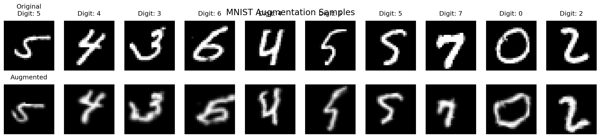

# MNIST CNN Pipeline

This project implements a Convolutional Neural Network (CNN) for the MNIST dataset with automated testing and validation through GitHub Actions.

## Project Structure 

├── .github/workflows/
│ └── ml-pipeline.yml
├── models/ # Directory for saved models
├── outputs/ # Directory for visualization outputs
├── train_model.py # Training script with OneCycleLR
├── test_model.py # Testing and model validation
├── model.py # CNN architecture with normalization options
├── normalization.py # Custom normalization layers
├── augmentation.py # Data augmentation pipeline
└── requirements.txt # Project dependencies

## Features
- CNN architecture for MNIST digit classification
- Multiple normalization options (Batch, Layer, Group)
- Extensive data augmentation pipeline
- OneCycleLR scheduler for optimal training
- Automated testing and validation
- Parameter count verification (<20,000 parameters)
- Training accuracy monitoring
- Model versioning with timestamps

## Model Architecture
- Input Layer: 28x28 grayscale images
- 3 Convolutional blocks with:
  - Batch/Layer/Group Normalization
  - Dropout layers
  - ReLU activation
- Transition layers with 1x1 convolutions
- Global Average Pooling
- Output: 10 classes (digits 0-9)

## Data Augmentation
The model uses several advanced augmentation techniques:
- Random Rotation (±8 degrees)
- Random Affine Transforms
  - Translation: ±10%
  - Scale: 90-110%
- Elastic Transform
- Random Perspective
- Gaussian Blur
- Random Erasing
- Normalization using dataset statistics

## Training Details
- Optimizer: Adam
  - Learning Rate: 0.01
  - Weight Decay: 0.0001
- OneCycleLR Scheduler
  - Max LR: 0.01
  - Pct Start: 0.3
  - Three Phase: False
  - Anneal Strategy: Cosine
- Batch Size: 128
- Epochs: 20

## CI/CD Pipeline
The GitHub Actions workflow automatically:
1. Checks model architecture:
   - Parameter count < 20,000
   - Presence of normalization layers
   - Presence of dropout
   - Proper input/output shapes
2. Trains model for 20 epochs
3. Tests model performance
4. Validates accuracy > 99.4%

## Requirements
- Python 3.8+
- PyTorch 2.1.0
- Other dependencies listed in requirements.txt

## Local Setup
1. Clone the repository

bash
git clone <repository-url>
bash
pip install -r requirements.txt
bash
python train_model.py
bash
python test_model.py
bash
python -m augmentation

## Model Checkpoints
Models are saved with timestamps and include:
- Model state dict
- Optimizer state
- Scheduler state
- Training metrics
- Normalization parameters

## Visualization
The augmentation pipeline includes visualization tools to inspect:
- Original vs augmented samples
- Different augmentation effects
- Training progress
- Model performance

## Notes
- The model achieves >99.4% accuracy on the test set
- Training uses full MNIST dataset (50k train, 10k test)
- All hyperparameters are tuned for optimal performance
- The pipeline includes extensive error checking and validation
